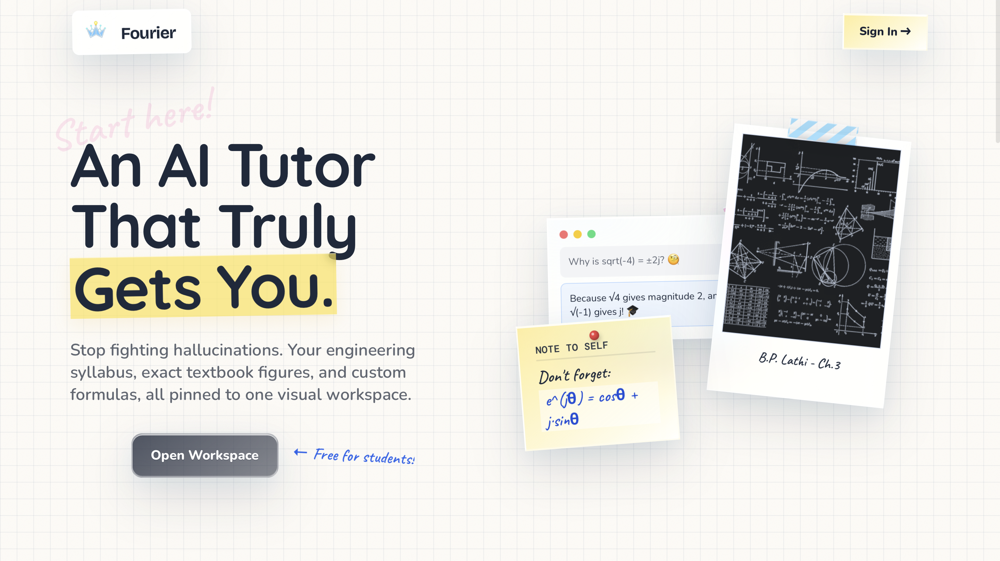
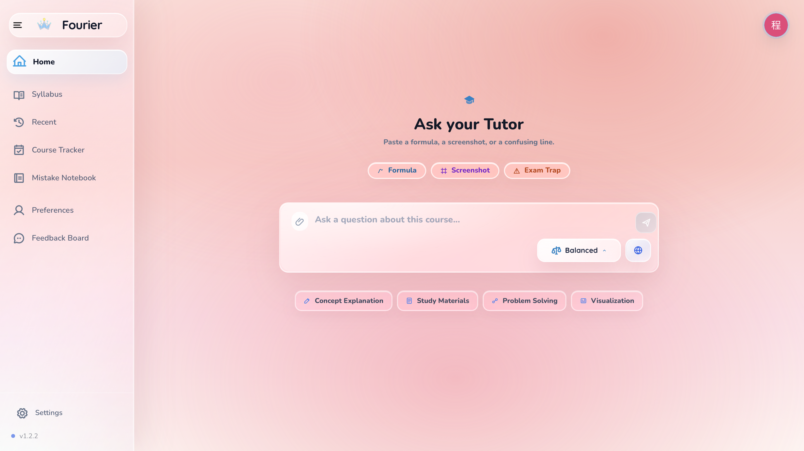
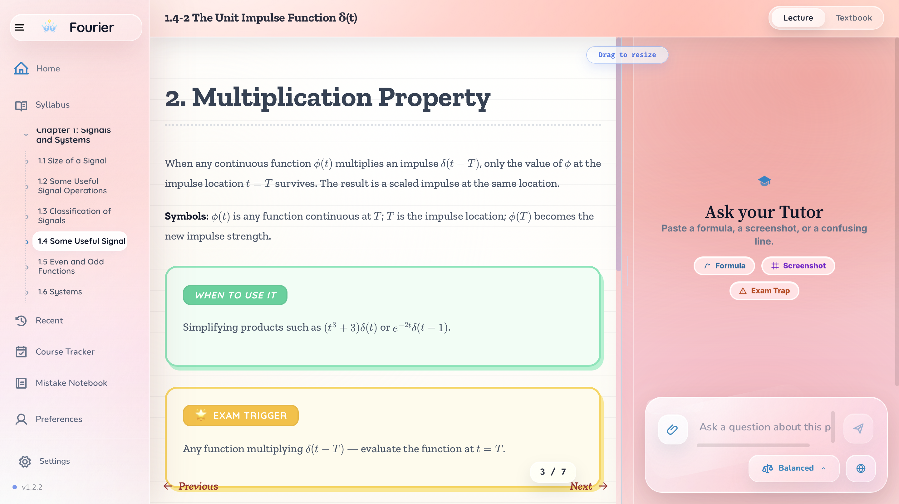

# Fourier Tutor Agent

An interactive full-stack tutor that turns a real engineering syllabus into a textbook-grounded learning workspace—with guided Q&A, visual demos, and progress continuity.

**Stack:** Node.js · Vanilla JavaScript · PostgreSQL / Neon · Playwright



## See the Learning Experience

### Ask in the Way You Are Already Thinking

Start with a formula, screenshot, exam trap, or open question, then choose the guidance depth and whether the Tutor may search the web.



### Keep the Lesson and Tutor Together

Resize the lesson and Tutor panels while keeping the explanation, textbook context, and follow-up questions in one workspace.



## More Than the Three Screens

- **Structured course navigation** — Move through the engineering syllabus and open textbook-grounded lessons with source figures nearby.
- **Interactive visual learning** — Manipulate signal-processing demos and connect formulas to visible behavior.
- **Adaptive Tutor guidance** — Choose response depth, ask contextual follow-ups, and enable optional web search when needed.
- **Learning continuity** — Track course progress, reopen recent sessions, and resume where you stopped.
- **Personal review tools** — Revisit mistakes and keep learner preferences across the experience.

## Product Architecture

From topic selection to lesson interaction, practice, and progress continuity.


[Open the editable architecture source](docs/architecture/learning-experience.architecture.html)

## Engineering Highlights

- **Browser-first UI** — Vanilla JavaScript coordinates lessons, demos, Q&A, practice, and responsive layout.
- **Textbook-grounded content** — The unified lesson cache ties lesson content to textbook pages, figures, and OCR.
- **Contextual Q&A pipeline** — Guidance options are generated first; the selected question then flows through retrieval and `/api/ask`.
- **Clear persistence boundaries** — Browser storage holds practice and chapter progress; authenticated Q&A sessions and preferences use server storage.
- **Regression-focused delivery** — Node checks, contract tests, Playwright flows, and visual baselines protect the learning experience.

```text
Browser UI → Node HTTP Bridge → Lesson Cache / Q&A Pipeline
           → Textbook Materials + LLM Providers → Browser State
```

<details>
<summary>Runtime and knowledge architecture</summary>


[Open the editable runtime architecture source](docs/architecture/runtime-knowledge.architecture.html)

</details>

## Run Locally

```bash
npm install
npm start
```

- Web UI: `http://127.0.0.1:9000`
- Health check: `http://127.0.0.1:9000/health`

Optional provider keys can be configured through environment variables. See [`app/.env.example`](app/.env.example).

## Explore the Code

```text
app/                    Browser UI, API bridge, lesson renderer, demos
workspace/materials/    Textbook pages, OCR, figures, lesson cache
tools/                  Contract tests, Playwright flows, visual baselines
docs/architecture/      Editable architecture sources and exported diagrams
```

- Start with [`app/index.html`](app/index.html) and [`app/app.js`](app/app.js) for the product flow.
- Follow [`app/ws-bridge.js`](app/ws-bridge.js) for API routing and Q&A orchestration.
- Open [`docs/architecture/`](docs/architecture/) for the product and runtime diagrams.

## Verification

```bash
npm run check
npm run test:guidance-ui
npm run test:geogebra
```

## Documentation

- [Product architecture](docs/architecture/learning-experience.architecture.html)
- [Runtime and knowledge architecture](docs/architecture/runtime-knowledge.architecture.html)
